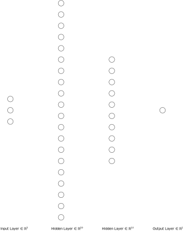

# Tetris Reinforcement Learning Agent in Pure C

## Overview
This repo implements a reinforcement learning agent that learns to play Tetris using a multi-layer neural network, all written in pure C without external ML libraries. The agent uses RL techniques such as experience replay, a target network, double Q-learning, and checkpointing to stabilise training and improve performance over time.

## Neural Network Architecture
The neural network estimates Q-values for different board states and consists of:

- **Input Layer:**
  - Aggregate height
  - Number of holes
  - Bumpiness

- **Hidden Layers:**
  - First Hidden Layer: 20 neurons, sigmoid activation
  - Second Hidden Layer: 10 neurons, sigmoid activation

- **Output Layer:**
  - Single neuron producing Q-value estimate

### Forward Pass
1. **Layer 1:** Compute activations using sigmoid:  

   %7D_i%20%3D%20%5Csigma(%5Csum%20W1_%7Bij%7D%20x_j%20%2B%20b1_i))

2. **Layer 2:** Compute activations similarly:  

   %7D_k%20%3D%20%5Csigma(%5Csum%20W2_%7Bki%7D%20h%5E%7B(1)%7D_i%20%2B%20b2_k))

3. **Output Layer:** Linear combination:  

   %7D_k%20%2B%20b3)

### Backpropagation
- Compute **TD Error**:

  

- Update weights with L2 regularization:  

  )

### Target Network
A separate target network provides stable Q-value estimates. It updates every 10 episodes.



## Reinforcement Learning Details
### Action Selection
- Simulate all valid placements for each piece.
- Use an **epsilon-greedy** policy to balance exploration and exploitation.

### Experience Replay
- Stores past transitions (state, reward, next state, done flag).
- Samples mini-batches to break sequential correlation.

### Checkpointing
- Saves network parameters and hyperparameters every episode.
- Reloads the best checkpoint if performance declines beyond 80%.

## Training Process and Hyperparameters
- **Alpha (Learning Rate):** Controls update magnitude, decays slowly.
- **Gamma (Discount Factor):** Prioritises future rewards.
- **Epsilon (Exploration Rate):** Decays to favor exploitation over time.
- **Lambda (L2 Regularization):** Prevents overfitting.
- **Target Network Update:** Every 10 episodes.

## Building and Running
### Build Instructions
```sh
make
```

### Running on Linux
```sh
./tetris
```
### Running on Windows
```sh
.\tetris.exe
```

## Notes and Further Improvements
- **Hyperparameter Tuning:** Experiment with different decay rates.
- **Feature Engineering:** Consider additional board metrics.
- **Monitoring:** Log TD errors and Q-value distributions.

## License
This project is for educational purposes. You are free to modify and extend it.